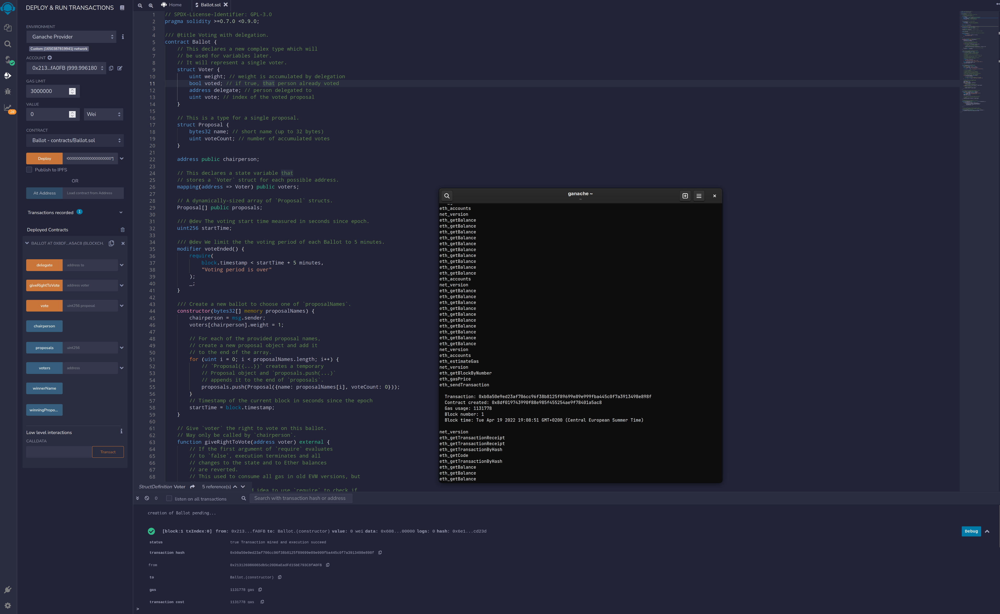
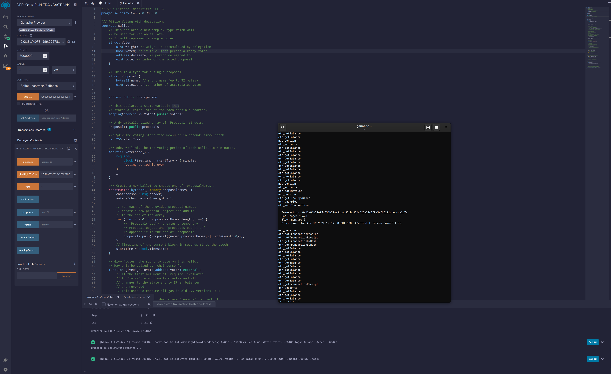
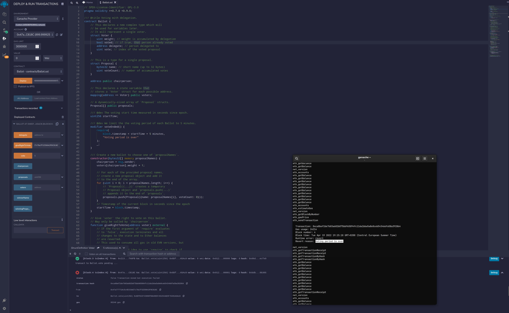

## A. Conceptual Knowledge

### What is a smart contract? How are they deployed? You should be able to describe how a smart contract is deployed and the necessary steps.

In "[Smart Contracts][1]" Nick Szabo defines a smart contract as a computerized transaction protocol that executes the terms of a contract. Contract Accounts can be triggered by humans sending a transaction, or by other contracts sending a message. When executed, can perform arbitrarily complex operations, allowing it to read and write to internal storage and send other messages, or create contracts. In the Ethereum environment contracts run (in a logical sense) on the *Ethereum Virtual Machine (EVM)*. We can think of the EVM as an emulation of a single, global “computer” in which all transactions are local on each node of the network and are executed in relative synchrony. Smart contracts run *EVM bytecode* when receiving a transaction, allowing them to perform calculations and further transactions. Smart Contracts can be written in a high-level language like Solidity or Vyper, they will be *compiled* in EVM bytecode. Deploying the smart contract on the blockchain is just sending a transaction containing the code of the compiled smart contract without specifying any recipients. In principle to deploy a smart contract you need:
1. The contract's bytecode.
2. An Ethereum node.
3. ETH for paying gas.
4. A deployment script or plugin.

We can use tools like [Hardhat](https://hardhat.org) or [Truffle](https://trufflesuite.com) to automatize all the steps described before. For example using Hardhat, once correctly installed by following the documentation on the site, we can launch a local node using `npx hardhat node`. This will generates also 20 accounts with 1000 ETH, which should be sufficient for a lot of local deployments/testing. We can write a script in JavaScript that deploy the contract on the specified chain (the local one by default, but we can also deploy it on Testnets/Mainnet leveraging services like Infura/Alchemy) and execute the script using `npx hardhat run path/to/script.js`

```javascript
async function main () {
    // We get the contract to deploy
    const Greeter = await ethers.getContractFactory('Greeter');
    console.log('Deploying Greeter...');
    const smart_contract = await Greeter.deploy();
    await smart_contract.deployed();
    console.log('Greeter deployed to:', smart_contract.address);
}

main()
    .then(() => process.exit(0))
    .catch(error => {
    console.error(error);
    process.exit(1);
});
```

In this case, the address of the deployed contract will be printed on the terminal and we can interact with it using Remix, the Hardhat console, or using a frontend.

### What is gas? Why is gas optimization such a big focus when building smart contracts?

All programmable computation in Ethereum is subject to fees. Any fragment of programmable computation has a cost in terms of **gas**. Gas does not exist outside of the execution of a transaction and very important, the gas is not ether. Transactors will necessarily have a trade-off between lowering gas price and maximizing the chances that their transaction will be mined relatively soon. Gas also circumvents the halting problem in fact if the contract does not stop, after a while, it might eventually run out of gas. When we build smart contracts we have to be very careful about the cost in gas of the single operations, this is because each operation has a fixed cost as described in the [yellow paper][2]. Since the cost in gas is paid by those who invoke a contract then we must optimize as much as possible the cost of operations, to minimize the expense of the end-user. 

### What is a hash? Why do people use hashing to hide information?
A hash function is a deterministic mathematical function that maps a set of inputs of arbitrary size to a fixed-length output.
In cryptographic applications the hash function is required to have the following properties:
1. preimage resistance: it must be computationally intractable to search for an input string that gives a hash equal to a given hash;
2. resistance to second pre-image: it is computationally intractable to search for an input string that gives a hash equal to a given string;
3. collision resistance: it is computationally intractable to search for a pair of inputs that give the same hash.

Hash functions are not reversible. The output of a hash function is a fixed-length string of characters called digest or simply a hash. Since are not reversible hashes are not necessarily intended to be kept secret because they cannot be converted back into their original values. People can use hashing to hide from third-party sensitive information, e.g. a password, and save only the computed hash. If we save sensitive information using hash an attacker can perform a [rainbow table][3] attack, so it's best practice for secure password storage to combine each password with a randomly generated string of characters called a "salt" and then to hash the result.

### How would you prove to a colorblind person that two different colored objects are actually of different colors?

A person who is not affected by dyschromatopsia, identifies the color of two objects and communicates to the colorblind the colors. The colorblind person then takes them in his hand and hides the objects behind him and has two options: he can swap them or leave them in the current hand. Then he shows the objects again to the other person who communicates the colors again. After a series of iterations of possible objects swaps and assignments, he can reach a certain level of confidence that the colors of the objects are actually different.

## B. You sure you’re solid with Solidity?

### Program a super simple “Hello World” smart contract.

The code is available on [GitHub][4].


*Deploy of the HelloWorld contract*

### On the documentation page, the “Ballot” contract demonstrates a lot of features on Solidity. Read through the script and try to understand what each line of code is doing.

Line 1: SPDX, an easy way to label your source code’s licenses, in this case GPL3.\
Line 2: The solidity compiler version accepted, more or equal of 0.7 and less than 0.9.\
Line 5: The contract name.\
Line 9 to 14: A `struct` Voter it's defined, you can now use `Voter` as it would be a primitive type.\
Line 17 to 19: Another `struct` for another complex type, that represents a `Proposal`.\
Line 22: A public state variable called `chairperson` is defined, of type `address`\
Line 26: A new `mapping` is created, it is a map that has as key address and as a value a `Voter`.\
Line 29: A dynamically-sized array of `Proposal` structs.\
Line 32: A public state variable called that represents the  voting start time measured in seconds since epoch.\
Line 44 to 59: The constructor that is called when the contract is instantiated. Who created the contract becomes the `chairperson` and the mapping voters is updated (with key `chairperson` and the value of weight becomes` 1`). For each proposal name passed into the constructor a new `Proposal` is created and added to the proposals array. The creation time of the contract is set in `startTime`.\
Line 63 to 81: The `giveRightToVote` function takes an address as input and checks if the person who called the function is the `chairperson`. It then checks to see if the input address has already voted.\
Line 84 to 120: If the caller hasn't already voted, he/she can delegate his/her vote to another account.\
Line 124 to 135: Give the caller's vote to the given proposal.\
Line 139 to 147: Computes the winning proposal, it simply takes the maximum `voteCount` value in the `proposals` array.\
Line 152 to 154: Returns the name of the winner, computed by `winningProposal()`.

### Suppose we want to limit the voting period of each Ballot contract to 5 minutes. 

The code is available on [GitHub][5].


*Deploy of the Ballot contract*


*Vote before 5 minutes*


*Vote after 5 minutes*

[1]: https://www.fon.hum.uva.nl/rob/Courses/InformationInSpeech/CDROM/Literature/LOTwinterschool2006/szabo.best.vwh.net/smart.contracts.html "Smart Contracts"
[2]: https://ethereum.github.io/yellowpaper/paper.pdf "Yellow Paper"
[3]: https://en.wikipedia.org/wiki/Rainbow_table "Rainbow Table"
[4]: https://github.com/lrazovic/zku/blob/main/assignment_0/HelloWorld.sol "Hello, World!"
[5]: https://github.com/lrazovic/zku/blob/main/assignment_0/Ballot.sol "Ballot with 5 minutes deadline"